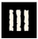
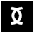

Les runes tiennent une place essentielle dans Glorantha. 

Elles sont partout et constitutives du monde. Les Erudits de l'Ambigu les ont formalisées mais elles étaient déjà présentes dès les origines. 

En particulier: 

* Les livres écrits ou imprimés sont triangulaires 
* La monnaie a la forme de la rune de l'échange (hormis les "Sols" Darahappiens qui sont ronds, les lunars qui ont la forme de la rune de la Lune, les bolgs qui sont des sorte de cailloux percés utilisés par le Uz)
* Des formes spiralées (arbres, pierres, collines, montagnes)
* Des champs carrés (i.e. pas de champs rectangulaires!)
* Les épées ont la forme de la rune de Mort 
* Les peaux sont marquées de tatouages qui apparaissent lors des initiations ou dans des cérémonies. Les Gloranthiens ne cachent pas leurs affiliations runiques en général (sauf les cultes trompeurs). 

Chaque rune a également une incidence sur le caractère de l'individu marqué par la rune. Aux joueurs de décider du caractère marquant induit par la rune i.e. tous les personnages n'ont pas tous les traits de caractère donnés en exemple et ils peuvent aussi en accord avec le sens de la rune trouver un autre de caractère adéquat. 

# Les runes de naissance sont liés aux éléments (hormis la Lune)

 AIR: lunatique 

 TERRE: pragmatique, fiable, protecteur, généreux 

 EAU: changeant, insaisissable, androgyne  

 FEU: droit, juste, inflexible

 OBSCURITE: secret, discret, cruel 

 LUNE: inclusif, illuminé, détaché, flegmatique  

* _Choisissez une rune forte_

Si vous êtes Orlanthi, la rune forte est l'Air pour les hommes ou la Terre pour les femmes.

Si vous êtes lunaire, votre rune est la Lune et vous n'avez pas de rune faible. 

* _Choisissez une rune faible_

Si vous êtes lunaire, vous n'avez pas de rune faible. 

# Les runes de talents 

Ces runes se développent en fonction de l'activité mais aussi de prédisposition naturelle. Elles ouvrent la porte à des initiations runiques particulières. 

Ces runes fonctionnent par paires. 

 MOUVEMENT: (s'oppose à Stase) svelte, souple, agile, impulsif 

 STASE: (s'oppose à Mouvement) fort, endurant, réfractaire

 VIE: (s'oppose à Mort) bon vivant, joyeux

 MORT: (s'oppose à Vie) lugubre, mélancolique

 HARMONIE: (s'oppose à Désordre) empathique, compatissant

 DESORDRE: (s'oppose à Harmonie) dérangé, lunatique

 VERITE: (s'oppose à Illusion) coincé, rigide, curieux, pédant, hautain 

 ILLUSION: (s'oppose à Vérité) fourbe, discret, timide, réservé  

* _Choisissez une rune forte et obtenez la rune opposée en rune faible._

# Les runes de forme 

Ces runes sont: 

* L'homme: c'est la rune de base des hominidés 
* L'esprit: cette rune est forte chez les chamans 
* La bête: c'est la rune de base chez les Hsunchens (les hommes-bêtes)
* La plante: c'est la rune des plantes mais aussi des elfes (Aldryamis)
* Le chaos: c'est la rune de la corruption, de la destruction
* Le dragon: c'est la rune des Dragons (un des grands mystères de Glorantha)

Sauf si vous voulez jouer un chaman, un elfe ou un homme-bête, vous avez la rune de l'homme qui n'amène rien de particulier hormis vous définir en tant qu'être dans l'univers et vous permet de communiquer avec vos semblables. 

Evidememnt posséder une rune différente des autres est signe d'une grande différence qu'il faudra jouer telle quelle. 

# Les runes de conditions 

Ces runes sont très rares et s'acquièrent en cours de jeu, hormis la loi, l'éternelle bataille ou la lune qui peut être acquise à la création. 

* La loi: c'est la rune de la rationalité 
* L'échange: c'est la rune de la commmunication et du commerce (de l'art?)
* La maitrise: c'est la rune des meneurs 
* L'éternelle bataille: c'est la rune de ceux qui lutte contre le Chaos 
* La non-vie: c'est la rune des morts vivants 
* L'infini: c'est une rune associée aux dragons essentiellement 
* La chance: c'est la rune des audacieux 
* Le destin: c'est la rune des héros et des prophéties 
* La lune: c'est la lune de l'inclusion et de l'Illumination
* Le chaos: c'est la rune de la destruction et de la corruption  
* Le dragon: c'est la rune du mysticisme 
* La magie: c'est la rune de l'outremonde 

Comme ces runes sont rares, cela place les personnages qui les possèdent en marge de la société quelque part (hormis pour la lune qui est un peu à part). 

## Les couleurs runiques

On a vu plus haut que le monde était chatoyant et cela va même jusqu'aux attributs physiques: peau, yeux, cheveux. 

On peut en effet, relier la couleur de peau, des yeux et des cheveux à la rune forte.  

Ces couleurs viennent de l'Autre Côté. Ainsi dans les quêtes héroïques, les attributs peuvent être amplifiés. On peut même se retrouver transformé à l'issue de la quête. 

Un individu peut être marqué à la naissance ou lors de son initiation aussi mais également à l'issue d'une quête héroïque. 

Les marques runiques corporelles peuvent aussi varier selon certains événements: après un rituel pendant une fête, pendant telle ou telle saison...  

Tous les organes ne sont pas forcément marqués. Certains auront des yeux orange, d'autres des cheveux rouge vif, d'autre une peau grise pâle. 

Voici quelques couleurs:  

* air: orange ou bleu 
* terre: vert olive ou marron  
* lune: rouge ou blanc  
* eau: bleu ou blanc 
* obscurité: gris terne ou noir  
* feu: jaune ou rouge

Les autres runes peuvent aussi colorer un personnage. 

Concernant les "races", il ne s'agit donc plus de couleurs mais de traits spécifiques héréditaires.  
* Yeux bridés pour les Kralori 
* Nez épatés et cheveux crépus chez les Agimori  
